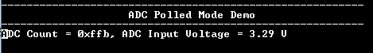

# ADCHS polling

This example application shows how to sample an analog input using the ADCHS peripheral and displays the converted samples on a serial terminal.

## Description

In this application, an analog input is converted by a software edge trigger. Converted digital value is displayed on the serial terminal.

## Downloading and building the application

To download or clone this application from Github, go to the [top level of the repository](https://github.com/Microchip-MPLAB-Harmony/csp_apps_pic32cx_bz24_bz25) and click

Path of the application within the repository is **apps/adchs/adchs_polled/firmware** .

To build the application, refer to the following table and open the project using its IDE.

| Project Name      | Description                                    |
| ----------------- | ---------------------------------------------- |
| WBZ351_curiosity.X | MPLABX project for [PIC32CX WBZ351 Curiosity Board]() |
|||

## Setting up the hardware

The following table shows the target hardware for the application projects.

| Project Name| Board|
|:---------|:---------:|
| WBZ351_curiosity.X | [PIC32CX WBZ351 Curiosity Board]() |
|||

### Setting up [PIC32CX WBZ351 Curiosity Board]()

- Connect the AN5 pin RB1 (Pin 8 of XPRO Header) to the Vcc (Pin 7 of the mikroBus connector)
- Connect the Debug USB port on the board to the computer using a micro USB cable

## Running the Application

1. Open the Terminal application (Ex.:Tera term) on the computer
2. Connect to the "USB to UART" COM port and configure the serial settings as follows:
    - Baud : 115200
    - Data : 8 Bits
    - Parity : None
    - Stop : 1 Bit
    - Flow Control : None
3. Build and Program the application project using its IDE
4. Console displays the ADC count and the ADC input voltage

